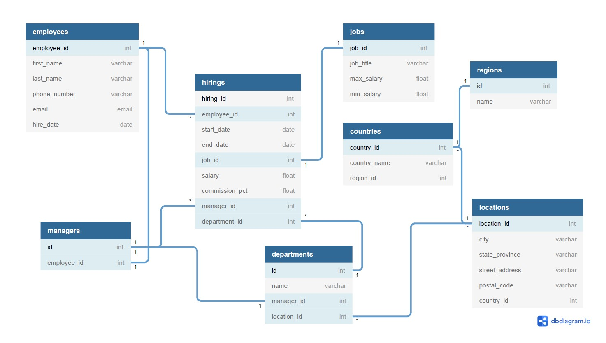

# Reto-SQL
#### Aaron Mendoza - Antornio Servin - Ferdinand Bracho

## Diagrama Base de datos


## Creacion de base de datos, tablas e insercion de datos para pruebas 
[Codigo sql](reto-o-sql.sql)

## Requerimientos de formularios 

#### Formulario para crear nuevas regiones
```sql
insert into regions(name)
values
        ('North America'),
        ('Europe'),
        ('Asia'),
        ('South America'),
        ('Oceania');
  ```
  
 #### Formulario de creación de países
 ```sql
 create table if not exists countries(
        id serial primary key not null,
        name varchar(25) not null unique,
        region_id int not null,
        foreign key (region_id) references regions(id)
);
```

#### Formulario para crear una nueva posición
```sql 
create table if not exists jobs(
        id serial primary key not null,
        title varchar(50) not null,
        max_salary float not null,
        min_salary float not null
);
```

#### Formulario para crear una nueva locación / oficina
```sql 
  create table if not exists locations(
        id serial primary key not null,
        city varchar (25) not null,
        state_province varchar (25) not null,
        street_address varchar (25) not null,
        postal_code int not null,
        country_id int not null,
        foreign key (country_id) references countries(id)
);
```

#### Formulario para crear nuevos departamentos / áreas de trabajo
```sql 
insert into departments(name,manager_id,location_id)
values
        ('Legal',3,5),
        ('Services',2,4),
        ('Engineering',1,3),
        ('Accounting',3,2),
        ('Support',2,1),
        ('Engineering',1,5),
        ('Product Management',3,4),
        ('Accounting',2,3),
        ('Research and Development',1,2),
        ('Legal',2,2);
```

#### Formulario para crear un nuevo empleado
```sql 
 insert into employees(first_name,last_name,phone_number,email,hire_date)
values
        ('Gilbertine', 'Goaley', '975-270-8218', 'ggoaley0@bing.com', '01/15/2021'),
        ('Leonanie', 'Gildea', '446-383-6209', 'lgildea1@aboutads.info', '08/05/2020'),
        ('Lyell', 'Ikins', '514-722-3305', 'likins2@pen.io', '04/22/2021'),
        ('Baxter', 'Jervoise', '520-120-4295', 'bjervoise3@yellowbook.com', '12/03/2020'),
        ('Lanni', 'Gilardengo', '548-824-1693', 'lgilardengo4@abc.net.au', '11/10/2020'),
        ('Tiffi', 'Jatczak', '673-341-6555', 'tjatczak5@ucoz.ru', '04/16/2021'),
        ('Yardley', 'Silversmid', '840-768-8816', 'ysilversmid6@ezinearticles.com', '11/28/2020'),
        ('Patrizio', 'Sayers', '984-660-3650', 'psayers7@paginegialle.it', '01/13/2021'),
        ('Godiva', 'Antley', '594-185-2663', 'gantley8@reference.com', '04/28/2021'),
        ('Teddi', 'Trenbey', '166-884-6680', 'ttrenbey9@nyu.edu', '01/16/2021');

insert into employees(first_name,last_name,phone_number,email,hire_date)
values
        ('Carlos', 'Santana', '975-270-3418', 'carlsantana0@bing.com', '04/23/2018')
returning id
```

#### Formulario para cambiar de puesto a un empleado
```sql 
update hirings
set end_date = '07/08/2021'
where employee_id = 1;

insert into hirings (employee_id, start_date, end_date, job_id, salary, comission_pct, manager_id, department_id)
values (1, '07/08/2021', null, 1, 30000, 40, 3, 7);
```

#### Formulario para editar los datos de un empleado
```sql
update employees
set first_name = 'nuevo_nombre',
last_name = 'nuevo_apellido',
email = 'nuevo-mail',
phone_number = 'nuevo_num',
hire_date = '01/01/2022'
where id = 10;
```

## Requerimientos de vistas

#### List of locations
```sql 
select 
        locations.id,
        city ,
        state_province ,
        street_address ,
        postal_code ,
        countries.name as country
from locations
inner join countries
        on countries.id = locations.country_id ;
```

#### List of locations per region
```sql
select
        locations.id,
        city ,
        state_province ,
        street_address ,
        postal_code ,
        countries.name as country,
        regions.name as region
from locations
inner join countries
        on countries.id = locations.country_id
inner join regions
        on regions.id = countries.region_id
order by regions.name;
```

#### List of employees
```sql
select first_name, last_name from employees;
```

#### Employee details
```sql
select * from employees
        left join hirings
                on employees.id = hirings.employee_id;
```

#### Employee history
``` sql 
select 
        employees.id,
        first_name ,
        last_name ,
        hire_date ,
        start_date,
        end_date,
        jobs.title as job
from employees
inner join hirings
        on hirings.employee_id = employees.id
inner join jobs
        on jobs.id = hirings.job_id 
where employees.id = 4;
```

#### List of departments per location 
```sql 
select 
        departments.id,
        departments.name as department,
        city,
        state_province,
        street_address,
        postal_code,
        countries.name as country
from departments
inner join locations
        on locations.id = departments.location_id
inner join countries
        on countries.id = locations.country_id;
```

#### List of employees per location
```sql 
select first_name as "FIRST NAME",last_name as "LAST NAME",locations.city as "CITY" ,state_province as "STATE",street_address as "STREET",postal_code as "ZIP",countries.name as "COUNTRY",regions.name as "REGION"  from employees 
        left join hirings on employees.id = hirings.employee_id
        inner join departments on hirings.departament_id = departments.id
        inner join locations on departments.location_id = locations.id
        inner join countries on locations.country_id = countries.id 
        inner join regions on countries.region_id  = regions.id 
        where locations.city = 'El Calvario'
        order by first_name; 
```

#### List of employees per department
```sql 
select first_name as "FIRST NAME",last_name as "LAST NAME", departments."name" as "DEPARTMENT" 
from employees 
left join hirings on employees.id = hirings.employee_id
inner join departments on hirings.departament_id = departments.id
where departments."name" = 'Engineering'
order by first_name;
```

#### List of employees by job
```sql 
select first_name as "FIRST NAME",last_name as "LAST NAME",jobs.title as "JOB TITLE" 
from employees
left join hirings on employees.id = hirings.employee_id 
inner join jobs on hirings.job_id  = jobs.id 
order by first_name,jobs.title;
```

#### Job details
```sql 
select title as "JOB TITLE",max_salary as "MAX SALARY",min_salary as "MIN SALARY" 
from jobs where title='Software Engineer III' order by title, max_salary;
```

#### Department details
```sql 
select 
        distinct departments.name, 
        employees.first_name as "manager",
        locations.city,
        count(hirings.employee_id) as "# employees"
from departments
        inner join managers 
                on departments.manager_id = managers.id
        left join employees
                on managers.employee_id = employees.id
        left join locations 
                on departments.location_id = locations.id
        left join hirings
                on departments.id = hirings.department_id 
where employees.id in (select managers.employee_id)
group by departments.name, employees.first_name, locations.city;
```

#### Responsabilities
```sql 
select 
	manager_emp.first_name as manager_name,
	manager_emp.last_name as manager_last_name,
	man.employee_name,
	man.employee_last_name
from (select 
	e.first_name as employee_name,
	e.last_name as employee_last_name,
	m.employee_id 
from hirings
inner join employees e
	on e.id = hirings.employee_id 
inner join managers m 
	on m.id = hirings.manager_id 
where hirings.end_date is null) as man
inner join employees manager_emp
	on manager_emp.id = man.employee_id
order by manager_emp.first_name ;
```
